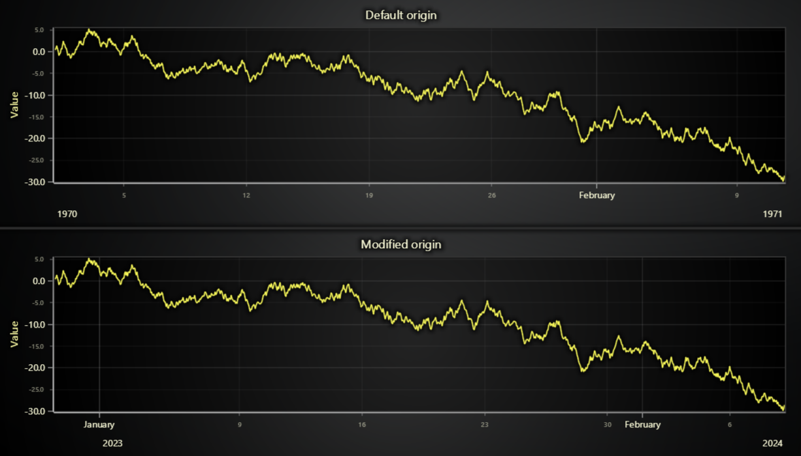

# DateTime Axis Origin



This demo application belongs to the set of examples for LightningChart JS, data visualization library for JavaScript.

LightningChart JS is entirely GPU accelerated and performance optimized charting library for presenting massive amounts of data. It offers an easy way of creating sophisticated and interactive charts and adding them to your website or web application.

The demo can be used as an example or a seed project. Local execution requires the following steps:

-   Make sure that relevant version of [Node.js](https://nodejs.org/en/download/) is installed
-   Open the project folder in a terminal:

          npm install              # fetches dependencies
          npm start                # builds an application and starts the development server

-   The application is available at _http://localhost:8080_ in your browser, webpack-dev-server provides hot reload functionality.


## Description

This example shows the usage of Origin Date with DateTime Axis TickStrategy, for rendering XY-series where either or both of X/Y dimensions can present _time_.

In the example, both charts use the same data, with each point of data set to be an hour apart along the X Axis; What is different between the charts, is the _origin_ for the DateTime TickStrategy used in the X Axis.

The top chart uses the default origin (January 1st, 1970), while the bottom chart uses a custom origin (set to current Date).

The _origin-date_ can be specified to whichever DateTime is desired. It is done by passing a _javascript Date object_ to the function that creates the _DateTime TickStrategy_:

```javascript
// Define the origin-date. (y, m [0-11], d [1-31], h [0-23])
const originDate = new Date(2002, 0, 1, 13)
// Create DateTime AxisTickStrategy with specified originDate.
const dateTimeTickStrategy = AxisTickStrategies.DateTime(originDate)
// Create a chart
const chart = lightningChart().ChartXY({})
// Get the default X Axis
chart
    .getDefaultAxisX()
    // Set the Tick Strategy to use
    .setTickStrategy(
        AxisTickStrategies.DateTime,
        // Use created DateTime AxisTickStrategy in the X Axis
        (tickStrategy) => tickStrategy.setDateOrigin(dat1eTimeTickStrategy),
    )
```

If this _TickStrategy_ would be supplied to an _X-Axis_, it would effectively mean that its scale would start from 1st of January 2002 14PM, so a _XY-point_ with coordinates `{ x: 0, y: 0 }` would be formated as `{ x: 1.1.2002 14:00, y: 0 }`.

It is worth mentioning that big _DateTime_-intervals can produce severe precision problems (eq. when zooming in). The only way to battle this is by reducing the distance of timestamps from the active _origin-date_.


## API Links

* [XY cartesian chart]
* [Scroll strategies]
* [Line series]
* [Progressive trace data generator]


## Support

If you notice an error in the example code, please open an issue on [GitHub][0] repository of the entire example.

Official [API documentation][1] can be found on [LightningChart][2] website.

If the docs and other materials do not solve your problem as well as implementation help is needed, ask on [StackOverflow][3] (tagged lightningchart).

If you think you found a bug in the LightningChart JavaScript library, please contact sales@lightningchart.com.

Direct developer email support can be purchased through a [Support Plan][4] or by contacting sales@lightningchart.com.

[0]: https://github.com/Arction/
[1]: https://lightningchart.com/lightningchart-js-api-documentation/
[2]: https://lightningchart.com
[3]: https://stackoverflow.com/questions/tagged/lightningchart
[4]: https://lightningchart.com/support-services/

© LightningChart Ltd 2009-2022. All rights reserved.


[XY cartesian chart]: https://lightningchart.com/js-charts/api-documentation/v6.1.0/classes/ChartXY.html
[Scroll strategies]: https://lightningchart.com/js-charts/api-documentation/v6.1.0/variables/AxisScrollStrategies.html
[Line series]: https://lightningchart.com/js-charts/api-documentation/v6.1.0/classes/LineSeries.html
[Progressive trace data generator]: https://arction.github.io/xydata/classes/progressivetracegenerator.html

